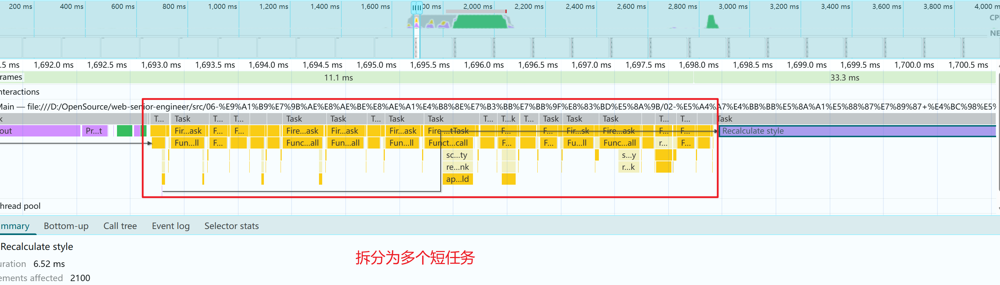

# 大任务切片 + 优先级调度

原生 scheduler.postTask（带降级处理），将长任务分片处理，并根据优先级安排调度

## ✅ 目标

- 假设我们要渲染一个超大的列表（如 10,000 项），但不能阻塞主线程；
- 我们使用 scheduler.postTask + TaskController + 分片执行；
- 在浏览器空闲时分批插入 DOM，不中断用户交互。

## 📝 效果

